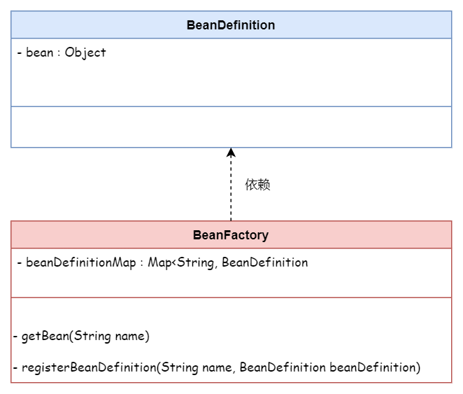

## 创建简单的 Bean 容器

### Bean 容器

我们将可以存储数据的数据结构称为容器。（如 List、Set、Map）

Spring Bean 容器选择了 `Map` 作为存储对象，通过 对象名称 / 对象类型 对 Bean 进行索引。

- `BeanDefinition`

Bean 的定义

- `BeanFactory`

Bean 工厂

用于生产和使用 Bean 对象

