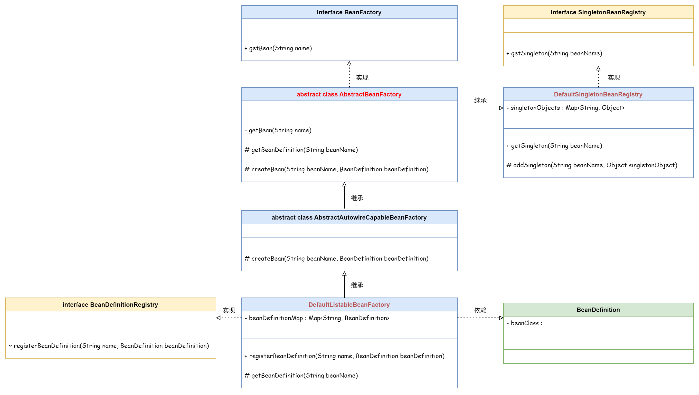

## 实现 Bean 的定义、注册、获取

- Bean 的创建，应该由容器 `BeanFactory` 创建

- 单例 Bean 创建后缓存在内存中 `Map`，可以直接获取



`AbstractBeanFactory` 中定义了两个抽象方法：

- `createBean(String beanName, BeanDefinition beanDefinition)`，最终由 `AbstractAutowireCapableBeanFactory` 实现


- `getBeanDefinition(String beanName)`，最终由 `DefaultListableBeanFactory extends AbstractAutowireCapableBeanFactory` 实现


```
winter-step-02
└── src
├── main
│   └── java
│       └── cn.letout.winterframework.beans
│           ├── factory
│           │   ├── config
│           │   │   ├── BeanDefinition.java  # Bean 定义
│           │   │   └── SingletonBeanRegistry.java  # 单例 Bean 注册接口
│           │   ├── support
│           │   │   ├── AbstractAutowireCapableBeanFactory.java  # extends AbstractBeanFactory
│           │   │   ├── AbstractBeanFactory.java  # implement BeanFactory
│           │   │   ├── BeanDefinitionRegistry.java
│           │   │   ├── DefaultListableBeanFactory.java  # extends AbstractAutowireCapableBeanFactory
│           │   │   └── DefaultSingletonBeanRegistry.java
│           │   └── BeanFactory.java  
│           └── BeansException.java  # 自定义异常
└── test
```