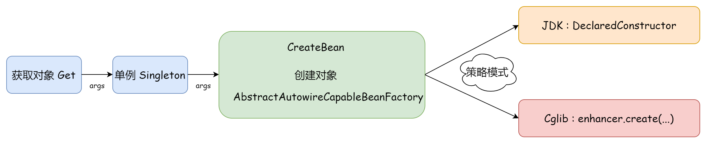
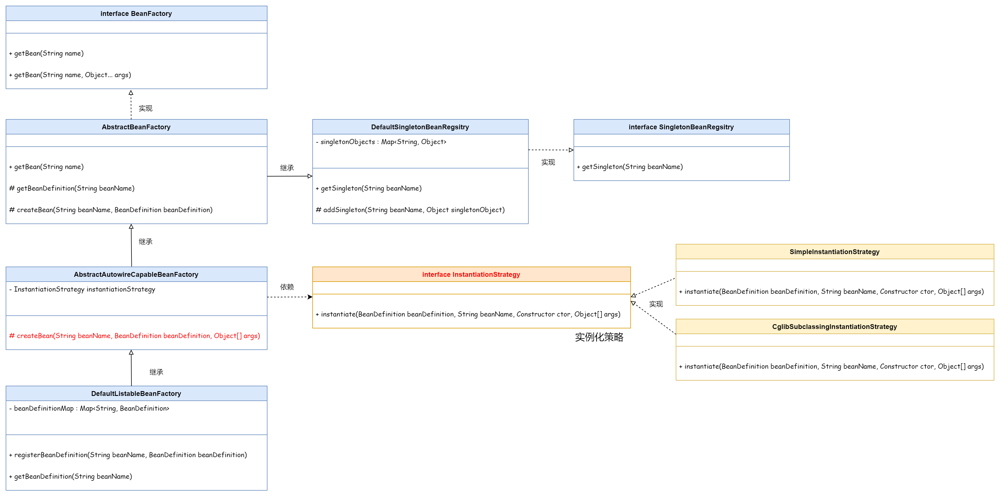

## ❄ 基于 Cglib 实现类的实例化策略

添加 Cglib 动态创建 Bean 对象。（Cglib 基于字节码框架 ASM 实现，通过 ASM 操作指令码来创建对象）



使用两种方式创建 Bean 对象，

- Java 反射 `DeclaredConstructor`
- Cglib 创建


通过使用策略模式，分别根据这两种方法，定义了两种策略 `implement InstantiationStrategy` ：

- `CglibSubclassingInstantiationStractegy`
- `SimpleInstantiationStrategy`

在策略上下文 `AbstractAutowireCapableBeanFactory` 中，决定创建的方式。




```
winter-step-02
└── src
    ├── main
    │   └── java
    │       └── cn.bugstack.springframework.beans
    │           ├── factory
    │           │   ├── config
    │           │   │   ├── BeanDefinition.java
    │           │   │   └── SingletonBeanRegistry.java
    │           │   ├── support
    │           │   │   ├── AbstractAutowireCapableBeanFactory.java  # 策略上下文
    │           │   │   ├── AbstractBeanFactory.java
    │           │   │   ├── BeanDefinitionRegistry.java
    │           │   │   ├── CglibSubclassingInstantiationStrategy.java  # Cglib
    │           │   │   ├── DefaultListableBeanFactory.java
    │           │   │   ├── DefaultSingletonBeanRegistry.java
    │           │   │   ├── InstantiationStrategy.java  # 策略接口
    │           │   │   └── SimpleInstantiationStrategy.java  # 反射
    │           │   └── BeanFactory.java
    │           └── BeansException.java
    └── test
```