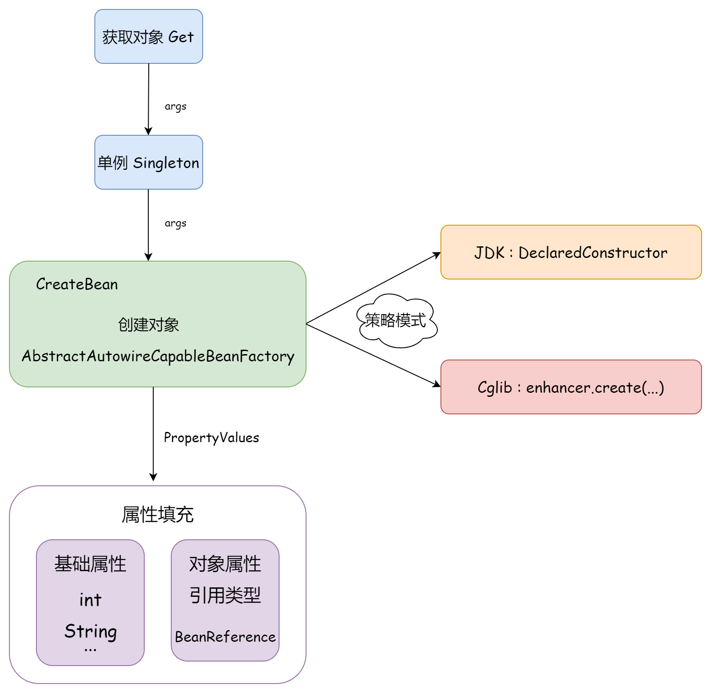
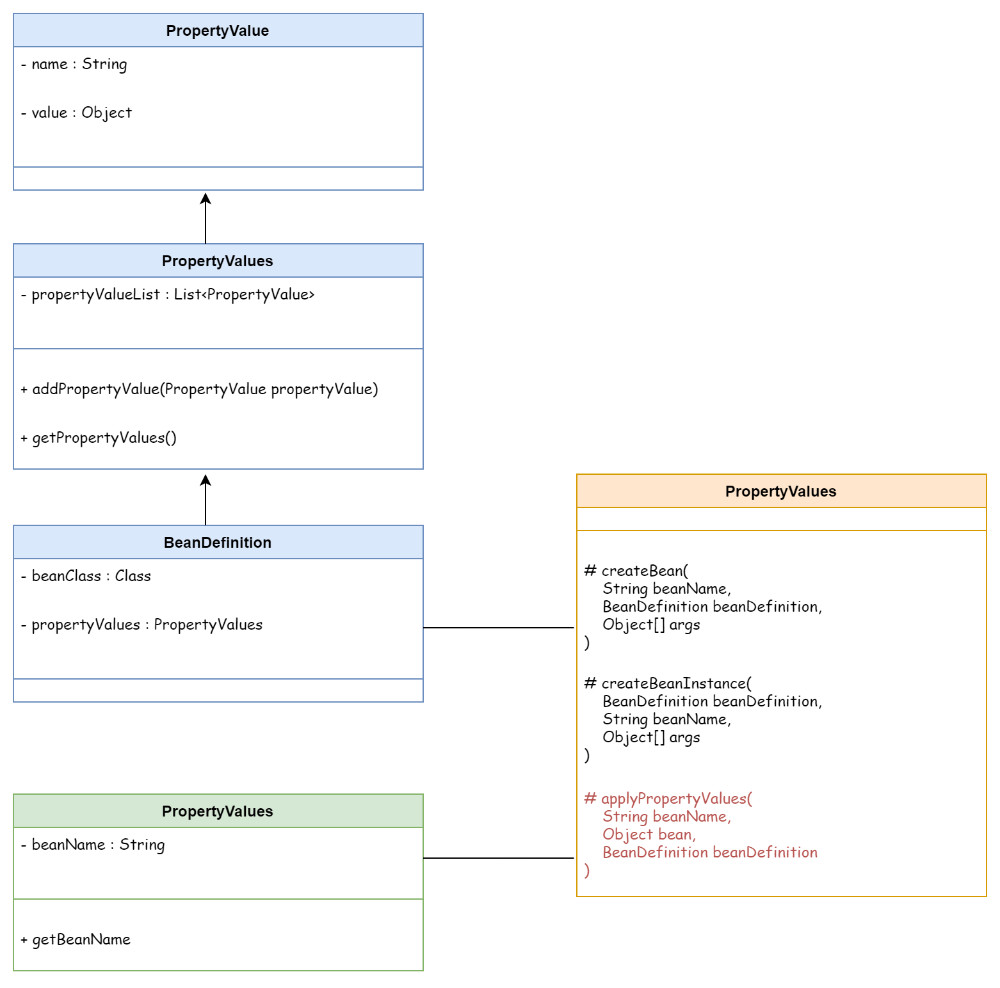

## ❄ 注入属性和依赖对象

在使用 反射 / Cglib 创建 Bean 对象后，如果类中包含属性，需要在实例化时填充属性信息，才能创建一个完整的 Bean 对象。

所有与 Bean 相关的定义都在 `BeanDefinition` 中，所有对象创建时需要的相关信息，都保存在 `PropertyValues` 成员对象中。

在 `AbstractAutowireCapableBeanFactory # createBean()` 中，添加 `applyPropertyValues()` 属性填充操作：

- `value instanceof BeanReference` ?
- 如果是基础类型，在创建时直接使用反射相关操作
- 如果是引用类型，使用 `BeanReference` 引用对象（包含了Bean对象名称），在具体实例化时进行创建，再使用反射填充

