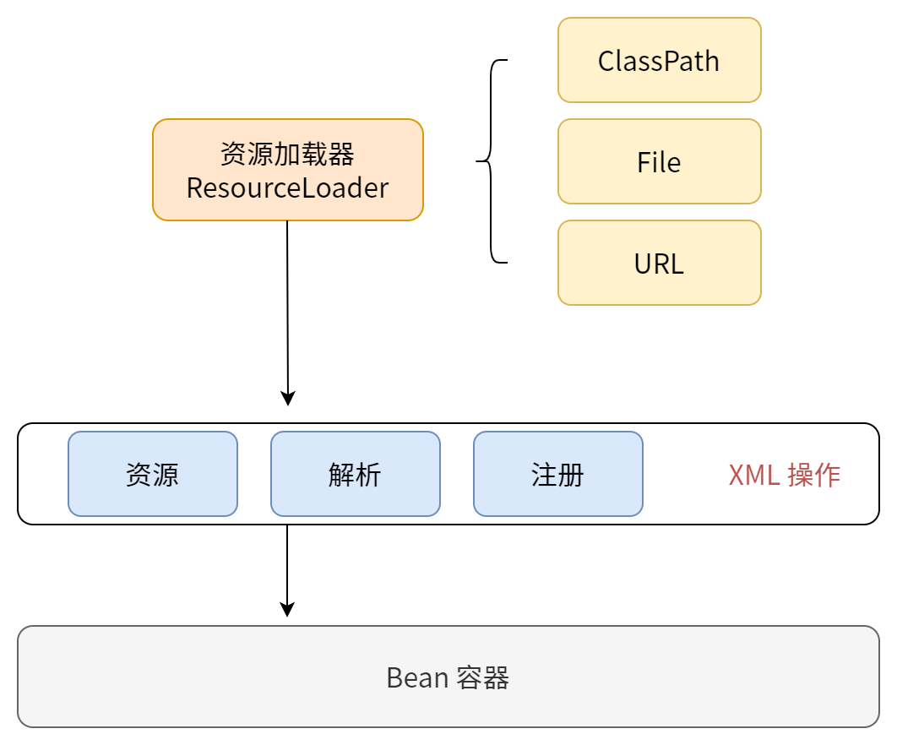
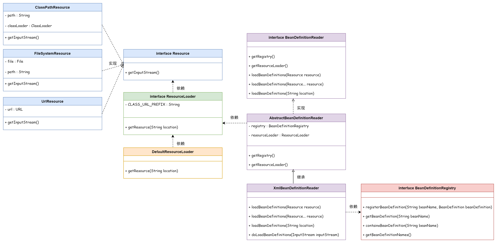
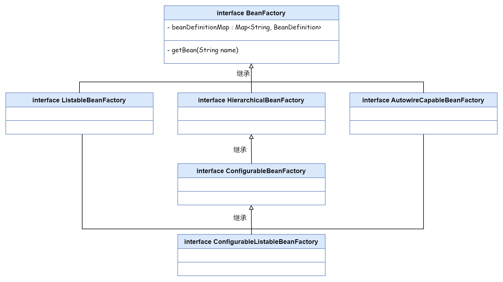

## ❄ 使用资源加载器解析配置文件

给框架添加一个资源加载器，获取多个地方的配置文件，并进行解析工作，将配置的 Bean 注册到容器中。

- 利用资源加载器读取 ClassPath / File / URL 的配置文件
- 对配置的 Bean 信息进行解析
- 将这些 Bean 注册到框架的容器中

### Bean Factory

- `interface BeanFactory`

  Bean 工厂

- `interface ListableBeanFacotry` `extends BeanFactory`

  扩展 BeanFactory 接口，提供了多种方法

- `interface HierarchicalBeanFactory` `extends BeanFacotry`

  子接口，提供了获取父类 BeanFactory 的方法

- `interface AutowireCapableBeanFactory` `extends BeanFactory`
  
  自动化处理 BeanFactory 配置的接口

- `interface ConfigurableBeanFactory` `extends HierarchicalBeanFactory, SingletonBeanRegistry`
  
  可获取 BeanPostProcessor、BeanClassLoader 等方法的配置化接口

- `ConfigurableListableBeanFactory` `extends ListableBeanFacotry, AutowireCapableBeanFacotry, ConfigurableBeanFacotry`
 
  一个提供分析和修改 Bean 对象，预先实例化的接口
